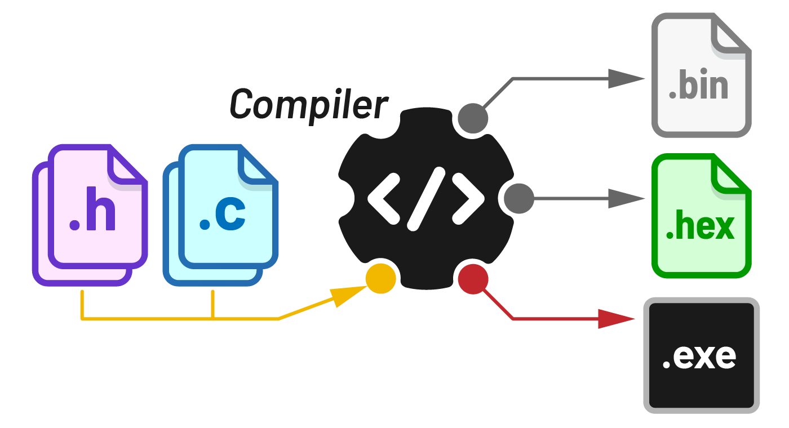
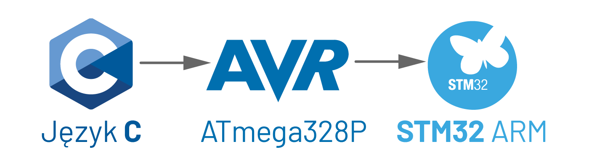
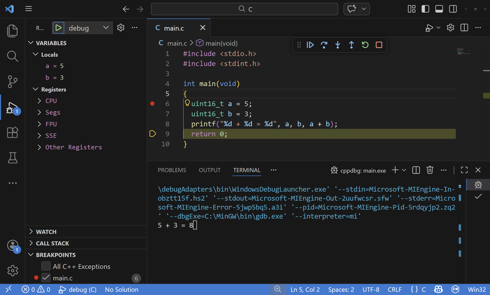

# 🎓 Ansi C

Język **C** jest językiem kompilowanym, wszystkie pliki źródłowe `.c` oraz nagłówkowe `.h` w projekcie są przetwarzane przez kompilator, który tworzy program wynikowy. Na systemach operacyjnych jest to aplikacja wykonawcza _(`.exe` na Windows)_, a na mikrokontrolery plik `.hex` lub `.bin`, który za pomocą programatora trafia do pamięci procesora. Kompilator języka C jest różny w zależności od architektury docelowej, ponieważ różne procesory mają różne zestawy rozkazów.



Kurs programowania w języku **C**, fundament pod programowanie mikrokontrolerów i systemów wbudowanych. Kurs można realizować równolegle z nauką **AVR**, natomiast solidna znajomość C jest konieczna przed przejściem na bardziej zaawansowane platformy jak **STM32**. Niezależnie od docelowej platformy, czasem warto odpalić coś lokalnie na komputerze, bez sprzętu i z łatwiejszym debugowaniem.



## 🤔 Dlaczego C?

Na języki programowania warto patrzeć jak na narzędzia. Język **C** powstał jako język ogólnego przeznaczenia, ale z biegiem lat z większości zastosowań został wyparty przez nowsze technologie jak **Java**, **PHP** czy **Python**. Niszą, w której **C** nadal góruje, są systemy wbudowane _(**embedded**)_.

Ale czemu tak stary język nadal jest najlepszy? Odpowiedź może niektórych rozczarować, ale prawda jest taka, że jest on po prostu **wystarczający**, a przez wieloletnią obecność na rynku zapewnia ogromne wsparcie ze strony społeczności i dostępnych rozwiązań. Dodatkowo **C** jest jedyną technologią, w której producenci mikrokontrolerów **zawsze** dostarczają wsparcie: pliki nagłówkowe, gotowe biblioteki itp.

W języku C bardzo często trzeba doimplementować funkcjonalności, które w językach wyższego rzędu są dostępne od ręki. Podczas programowania mikrokontrolerów jesteśmy ograniczani zarówno mocą obliczeniową jak i dostępnością pamięci, więc o tym co trafia do naszego programu decydujemy sami. Już dodatki z **C++**, takie jak obiekty czy łańcuchy znaków, ze względu na narzut często nie są wykorzystywane. Nawet w samym **C** rezygnuje się z ciężkich funkcji bibliotecznych jak `sprintf`, której waga w kB rzadko się opłaca, zamiast tego stosuje się prostsze, szyte na miarę rozwiązania. Czasem korzystamy z wbudowanych bibliotek, niekiedy dopisujemy własne, a gdy dysponujemy mocniejszym mikrokontrolerem, sięgamy po bardziej rozbudowane biblioteki z zewnątrz. Cały czas balansując na krawędzi funkcjonalności, zajętości pamięci i szybkości wykonywania kodu.

Język **C** ma stosunkowo wysoki próg wejścia, wskaźniki, ręczne zarządzanie pamięcią, brak wbudowanych struktur danych, ale sufit przychodzi szybko. W C nie ma _"wysokiego poziomu"_, to co widzisz, to co dostajesz. Paradoksalnie języki takie jak **Python**, które na starcie wydają się proste, na zaawansowanym poziomie potrafią być trudniejsze, dekoratory, metaklasy, GIL, async, zarządzanie środowiskami. W C cała złożoność jest od razu na stole.

### 🔧 Dlaczego nie Assembler?

Przede wszystkim nie jest przenośny, instrukcje różnią się w zależności od architektury procesora, podczas gdy kod w C można z łatwością przenieść na inną platformę. Składnia C jest bardziej przystępna i czytelniejsza. W większości przypadków optymalizacja kompilatora C/C++ i tak będzie lepsza niż ręcznie pisany Assembler. Assembler pozostaje świetnym narzędziem do zadań specjalnych, jednak nie na początku nauki.

## 📦 Co potrzebujemy?

- Kompilator języka **C** przygotowany pod system Windows, jakim jest [**MinGW**](https://www.mingw-w64.org/). Dzięki niemu kod źródłowy w języku **C** skompilujemy do aplikacji `.exe`, którą można uruchomić na komputerze.
- [Klient **GIT**](https://git-scm.com/download/win), który pozwoli sklonować to repozytorium i tworzyć z niego nowe projekty.
- Edytor kodu **IDE**, jakim jest [**VSCode**](https://code.visualstudio.com/). Chociaż formalnie można obejść się bez niego, to narzędzie bywa niezmiernie pomocne. Wyłapuje większość błędów, koloruje składnię oraz podpowiada podczas tworzenia kodu.
- Narzędzie [**Make**](https://www.gnu.org/software/make/), które automatyzuje proces kompilacji programów.

<!-- 📸 Grafika: schemat kompilacji main.c → gcc → main.exe -->

Aby zainstalować **MinGW** oraz **Make**, można skorzystać z wbudowanego menedżera pakietów [**winget**](https://learn.microsoft.com/en-us/windows/package-manager/winget/):

```sh
winget source update
winget install -e --id BrechtSanders.WinLibs.POSIX.UCRT --location C:\MinGW
winget install -e --id GnuWin32.Make
```

⏳ _Ekstrakcja archiwum może potrwać kilka minut!_

W przypadku problemów z instalacją przez **winget**, kompilator można [pobrać bezpośrednio](https://sqrt.pl/MinGW.zip) i umieścić w lokalizacji `C:\MinGW`, a aplikację **Make** [pobrać bezpośrednio](https://sqrt.pl/Make.zip) i umieścić w folderze `C:\Make`. W tym przypadku należy ręcznie dodać ścieżkę do zmiennej systemowej `Path`. _Nie tworzymy nowej zmiennej systemowej ani nie nadpisujemy istniejących wpisów!_

🪟 `Win` + `R` » `sysdm.cpl` » Advanced » **Environment Variables**

- 🖱️`Path` » 🆕`C:\MinGW\bin`
- 🖱️`Path` » 🆕`C:\Make\bin`

Na zakończenie należy otworzyć konsolę i zweryfikować, czy wszystkie pakiety zostały zainstalowane poprawnie:

```sh
gcc --version
gdb --version
make --version
```

## 🏗️Build 🚀Run

Aby sklonować repozytorium, a tym samym utworzyć nowy projekt, wystarczy _(o ile mamy zainstalowanego [klienta Git](https://git-scm.com/download/win))_ wykonać następującą komendę `clone`:

```sh
git clone https://github.com/Xaeian/C
```

Kompilacja i uruchomienie programu odbywa się za pomocą narzędzia `make`:

```sh
make # build
make run # build & run
```

Pierwsza komenda kompiluje plik `main.c` do `main.exe`. Druga dodatkowo uruchamia program. Konfiguracja procesu kompilacji zawarta jest w pliku `makefile`.

## 🐛🐞🪲 Debug

Repozytorium zawiera gotową konfigurację debuggera w folderze `.vscode`. Aby rozpocząć debugowanie w **VSCode**:

- Kliknij na marginesie obok numeru linii, aby ustawić 🔴**breakpoint** 
- Naciśnij `F5`, program skompiluje się z flagą `-g` i zatrzyma na pierwszym breakpoincie

Po zatrzymaniu programu na breakpoincie w górnym pasku pojawiają się **strzałki** sterujące:

- ▶️ **Continue** (`F5`) — Kontynuuj do następnego breakpointu
- ⏭️ **Step Over** (`F10`) — Wykonaj bieżącą linię i przejdź do następnej
- ⬇️ **Step Into** (`F11`) — Wejdź do wnętrza wywoływanej funkcji
- ⬆️ **Step Out** (`Shift+F11`) — Wyjdź z bieżącej funkcji

W panelu po lewej stronie widoczne są wartości zmiennych lokalnych i globalnych, które aktualizują się w czasie rzeczywistym po każdym kroku. Można tam też obserwować wybrane wyrażenia dodając je w sekcji **Watch**.

